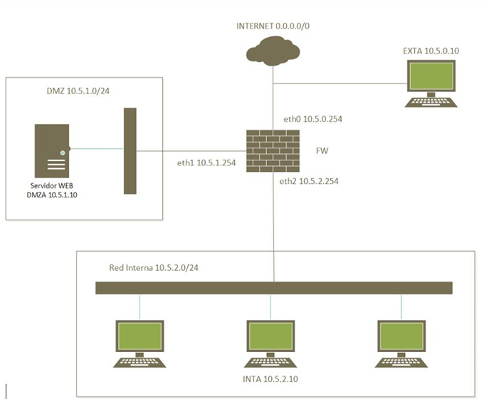

# Hardening Perimetral y Gestión de Reglas de Estado con Linux Iptables en Arquitecturas DMZ

| Campo | Descripción |
| :--- | :--- |
| **Tecnologías / Herramientas** | Linux Iptables, NETinVM, Netcat (`nc`), KWrite  |
| **Tags / Keywords** | #FirewallHardening, #Iptables, #DMZ-Isolation, #NetworkSecurity, #BlueTeam |
| **Categorías** | Análisis de Amenazas |
| **Autor** | Kevin López Granado  |

---

## Hardening Perimetral en Redes Multizona - [ACADEMIC - Intermediate]

### 🎯 Objetivo

El propósito de esta actividad es reforzar los conocimientos prácticos sobre topologías de defensa perimetral mediante el diseño y la implementación de un conjunto de reglas de filtrado y traducción de direcciones en un cortafuegos (`fw`) basado en **Iptables**. Se busca aislar y proteger tres segmentos de red diferenciados de la empresa *Example*: una red exterior que simula Internet ($10.5.0.0/24$), una Zona Desmilitarizada o DMZ ($10.5.1.0/24$) y una red interna corporativa ($10.5.2.0/24$).

---

### 🚀 Ejecución

### 🏢 Topología y Direccionamiento de Interfaces

El cortafuegos central (`fw`) interconecta los segmentos utilizando tres interfaces de red específicas:
* **`eth0`**: Interfaz conectada a la red externa / Internet (IP: `10.5.0.254`).
* **`eth1`**: Interfaz conectada a la DMZ (IP: `10.5.1.254`).
* **`eth2`**: Interfaz conectada a la red interna corporativa (IP: `10.5.2.254`).

---

### 📊 Matriz de Reglas Iptables

| # | Acción / Requerimiento | Reglas de Iptables |
| --- | --- | --- |
| **1** | Listar las reglas de la tabla filter en modo detallado  | `iptables -t filter -L -v`  |
| **2** | Borrar todas las reglas de la tabla filter  | `iptables -t filter -F`  |
| **3** | Establecer una política restrictiva en la cadena que falta  | `iptables -P INPUT DROPiptables -P FORWARD DROPiptables -P OUTPUT DROP`  |
| **4** | Permitir el tráfico de conexiones ya establecidas en todas las cadenas de la tabla filter  | `iptables -A INPUT -m state --state ESTABLISHED,RELATED -j ACCEPTiptables -A FORWARD -m state --state ESTABLISHED,RELATED -j ACCEPTiptables -A OUTPUT -m state --state ESTABLISHED,RELATED -j ACCEPT`  |
| **5** | Permitir las nuevas conexiones salientes desde la red local a los servidores DNS (UDP) públicos de Cloudflare (IP: 1.1.1.1 y 1.0.0.1) que se encuentran en internet  | `iptables -A FORWARD -i eth2 -o eth0 -s 10.5.2.0/24 -d 1.1.1.1 -p udp --dport 53 -m state --state NEW -j ACCEPTiptables -A FORWARD -i eth2 -o eth0 -s 10.5.2.0/24 -d 1.0.0.1 -p udp --dport 53 -m state --state NEW -j ACCEPT`  |
| **6** | Reasigne como destino al servidor web de la DMZ todas las nuevas conexiones desde la red local a servidores web seguros en internet  | `iptables -t nat -A PREROUTING -i eth2 -s 10.5.2.0/24 -p tcp --dport 443 -j DNAT --to-destination 10.5.1.10`  |
| **7** | Permitir las nuevas conexiones HTTPS desde el servidor web en la DMZ a servidores web de internet  | `iptables -A FORWARD -i eth1 -o eth0 -s 10.5.1.10 -p tcp --dport 443 -m state --state NEW -j ACCEPT`  |
| **8** | Permitir las nuevas conexiones SSH desde el PC exta al servidor web  | `iptables -A FORWARD -i eth0 -o eth1 -s 10.5.0.10 -d 10.5.1.10 -p tcp --dport 22 -m state --state NEW -j ACCEPT`  |
| **9** | Permitir las nuevas conexiones HTTPS y SFTP desde el cortafuegos al servidor de actualizaciones de Debian en España (IP: 82.194.78.250) que se encuentra en internet  | `iptables -A OUTPUT -o eth0 -d 82.194.78.250 -p tcp --dport 443 -m state --state NEW -j ACCEPTiptables -A OUTPUT -o eth0 -d 82.194.78.250 -p tcp --dport 22 -m state --state NEW -j ACCEPT`  |
| **10** | Permitir las nuevas conexiones desde la red local al futuro servidor de escritorio remoto (RDP) que se encontrará en la DMZ (10.5.1.89)  | `iptables -A FORWARD -i eth2 -o eth1 -s 10.5.2.0/24 -d 10.5.1.89 -p tcp --dport 3389 -m state --state NEW -j ACCEPT`  |

---

### 📝 Resumen

En esta actividad se ha diseñado un modelo de seguridad perimetral basado en el principio de **menor privilegio** empleando Linux Iptables. Se eliminó la configuración laxa por defecto y se sustituyó por una política de denegación estricta (`DROP`) en los flujos `INPUT`, `FORWARD` y `OUTPUT`.

A partir de este estado de *Zero Trust*, se definieron reglas con inspección de estado (Stateful) minuciosas, limitando el tráfico según interfaces de entrada/salida, direcciones IP de origen/destino y puertos de capa de transporte específicos. Entre las soluciones implementadas destaca la integración de técnicas de **DNAT** para forzar el paso del tráfico web interno a través de la DMZ y el aislamiento del tráfico de administración (SSH) a un único origen legítimo en el exterior (`exta`).

---

### 💡 Conclusiones

- **La Denegación por Defecto como Pilar:** Establecer políticas `DROP` como base del cortafuegos garantiza que cualquier vector de ataque o protocolo no contemplado explícitamente quede completamente neutralizado de forma nativa.
- **Eficiencia mediante Inspección de Estado:** El uso del módulo `state` (`ESTABLISHED,RELATED`) simplifica radicalmente el tablón de reglas. Permite que el firewall valide automáticamente el tráfico de retorno de las conexiones legítimas sin necesidad de abrir puertos bidireccionales de manera permanente.
- **Defensa en Profundidad con DMZ:** Forzar a la red interna a interactuar con Internet a través de un intermediario en la DMZ (mediante DNAT) evita la exposición directa de los hosts internos, añadiendo una capa de inspección y anonimato dentro de la infraestructura corporativa.
- **Segmentación Estricta de la Administración:** Limitar el acceso SSH a un único direccionamiento IP externo (`exta`) mitiga los ataques de fuerza bruta generalizados y reduce drásticamente la superficie de exposición de los activos críticos de la DMZ.