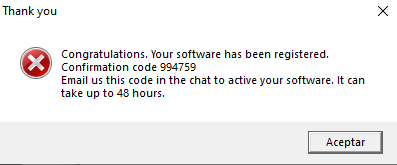
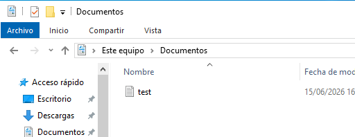
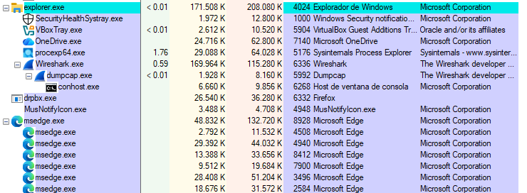

# Dynamic Analysis

## Objetivo

El objetivo del análisis dinámico es ejecutar la muestra `malware.exe` en una máquina virtual Windows 10 aislada y observar su comportamiento en tiempo de ejecución.

Durante esta fase se monitorizan procesos, sistema de archivos, claves de registro, mecanismos de persistencia, actividad visible para el usuario y tráfico de red. El objetivo es validar o descartar las hipótesis generadas durante el análisis estático.

---

## Herramientas utilizadas

| Herramienta      | Uso                                                          |
| ---------------- | ------------------------------------------------------------ |
| Process Monitor  | Monitorización de actividad de archivos, registro y procesos |
| Process Explorer | Observación de procesos activos, PID, rutas y descripciones  |
| Autoruns         | Identificación de mecanismos de persistencia                 |
| Regshot          | Comparación del estado del registro antes y después          |
| Wireshark        | Captura de tráfico durante la ejecución                      |

Los reportes y capturas generados por estas herramientas se almacenan en:

```text
reports/
├── process_monitor/
├── process_explorer/
├── autoruns/
├── regshot/
└── wireshark/
```

---

## Preparación previa a la ejecución

Antes de ejecutar la muestra se preparó el entorno para capturar la mayor cantidad posible de actividad relevante.

Acciones realizadas:

* Restauración del snapshot previo a ejecución.
* Confirmación del aislamiento de red.
* Verificación de que no existían datos personales ni credenciales reales.
* Captura inicial del registro con Regshot.
* Inicio de Process Monitor.
* Inicio de Process Explorer.
* Inicio de Wireshark.
* Preparación de Autoruns para revisión posterior.
* Ejecución de la muestra desde el usuario `analyst`.

La muestra se ejecutó bajo supervisión para observar cambios en procesos, archivos, registro, persistencia y red.

---

## Datos de ejecución

| Campo                       | Resultado                                               |
| --------------------------- | ------------------------------------------------------- |
| Usuario de ejecución        | `analyst`                                               |
| Ruta de ejecución           | `C:\MalwareLab\Sample\malware\malware.exe`              |
| Hora de ejecución           | 18:36:55                                                |
| Proceso inicial             | `malware.exe`                                           |
| PID inicial                 | 6096                                                    |
| Proceso posterior observado | `drpbx.exe`                                             |
| PID del proceso posterior   | 6332                                                    |
| Resultado visible           | Ventana “Thank you” y modificación de archivo de prueba |

---

## Comportamiento general observado

Durante la ejecución se observaron comportamientos compatibles con una muestra tipo ransomware o blackmailer.

| Categoría         | Evidencia                                                        | Interpretación                                                    |
| ----------------- | ---------------------------------------------------------------- | ----------------------------------------------------------------- |
| Ejecución inicial | `C:\MalwareLab\Sample\malware\malware.exe`                       | Proceso inicial ejecutado manualmente                             |
| Copia en disco    | `C:\Users\analyst\AppData\Roaming\Frfx\firefox.exe`              | Copia persistente que suplanta Firefox                            |
| Copia secundaria  | `C:\Users\analyst\AppData\Local\Drpbx\drpbx.exe`                 | Proceso o artefacto secundario creado por la muestra              |
| Directorio creado | `C:\Users\analyst\AppData\Roaming\System32Work`                  | Carpeta creada dentro del perfil del usuario                      |
| Persistencia      | `HKCU\SOFTWARE\Microsoft\Windows\CurrentVersion\Run\firefox.exe` | Ejecución automática al iniciar sesión                            |
| Archivo afectado  | `C:\Users\analyst\Documents\test.txt.fun`                        | Archivo de prueba modificado con extensión `.fun`                 |
| Suplantación      | Firefox / `firefox.exe`                                          | Uso de nombre e iconografía asociada a software legítimo          |
| Red               | DHCP, DHCPv6, LLMNR                                              | No se observó comunicación externa efectiva atribuible al malware |

---

## Actividad visible para el usuario

Tras la ejecución se observó una ventana titulada **“Thank you”**, con un mensaje de confirmación o registro.

Aunque este mensaje no confirma por sí solo el objetivo completo de la muestra, sí demuestra que el binario muestra interacción gráfica con el usuario, coherente con el subsistema GUI identificado durante el análisis estático.

Esta evidencia se relaciona con el uso de `user32.dll`, observada previamente en el análisis estático.

*Figura 1: Mensaje tras ejecución malware.exe*

---

## Modificación de archivos

La muestra modificó un archivo de prueba ubicado en la carpeta Documentos del usuario.

Archivo original:

```text
test.txt
```

*Figura 2: Test de documento creado*

Archivo resultante:

```text
test.txt.fun
```

*Figura 3: Test de documento encriptado*

El contenido del archivo quedó ilegible tras la ejecución, lo que indica un comportamiento compatible con cifrado o alteración maliciosa de archivos.

*Figura 4: Test de contenido documento encriptado*

Este comportamiento es especialmente relevante porque durante el análisis estático ya se habían identificado cadenas como:

```text
EncryptFile
DecryptFile
CreateEncryptor
Your computer files have been encrypted
```

Por tanto, existe correlación entre los indicadores estáticos y el comportamiento dinámico observado.

---

## Copias creadas en el sistema

Process Monitor permitió identificar actividad relacionada con la creación de carpetas y copias en rutas del perfil del usuario.

Rutas relevantes:

```text
C:\Users\analyst\AppData\Roaming\Frfx\firefox.exe
C:\Users\analyst\AppData\Local\Drpbx\drpbx.exe
C:\Users\analyst\AppData\Roaming\System32Work
```

La ruta más relevante es:

```text
C:\Users\analyst\AppData\Roaming\Frfx\firefox.exe
```

*Figura 5: Prueba persistencia malware*

Esta copia se utiliza posteriormente como objetivo de la clave de persistencia en el registro.

---

## Persistencia

Autoruns confirmó una entrada sospechosa en la clave:

```text
HKCU\SOFTWARE\Microsoft\Windows\CurrentVersion\Run
```

Con el valor:

```text
firefox.exe
```

Apuntando a:

```text
C:\Users\analyst\AppData\Roaming\Frfx\firefox.exe
```

*Figura 5: Prueba persistencia Autoruns*

La entrada aparece con descripción asociada a Firefox y firma no verificada. Este comportamiento indica que la muestra intenta ejecutarse automáticamente cada vez que el usuario inicia sesión.

La persistencia mediante claves Run en HKCU es un mecanismo común porque no requiere privilegios de administrador y afecta al usuario actual.

---

## Proceso secundario observado

Process Explorer mostró un proceso denominado:

```text
drpbx.exe
```

Ejecutado desde:

```text
C:\Users\analyst\AppData\Local\Drpbx\drpbx.exe
```

*Figura 6: Prueba proceso suplantación*

El proceso aparecía con descripción asociada a Firefox, lo que indica una técnica de suplantación o masquerading.

Este comportamiento busca dificultar la identificación del proceso por parte del usuario o de un analista, utilizando nombres familiares o aparentemente legítimos.

---

## Suplantación de Firefox

La muestra utiliza varios elementos asociados a Firefox:

* Nombre `firefox.exe`.
* Descripción Firefox.
* Copia en una ruta de usuario.
* Proceso visible como Firefox.
* Entrada de persistencia con nombre `firefox.exe`.

Este conjunto de indicadores sugiere una técnica de suplantación de software legítimo.

El uso de una ruta como `AppData\Roaming\Frfx\firefox.exe` resulta sospechoso, ya que no corresponde a una ruta estándar de instalación de Firefox.

---

## Cambios en el registro

Regshot mostró una gran cantidad de cambios entre la captura inicial y la captura posterior.

Gran parte de esos cambios corresponden a ruido normal del sistema operativo. Por este motivo, las modificaciones relevantes se contrastaron con Autoruns y Process Monitor.

El cambio principal confirmado fue la persistencia en:

```text
HKCU\SOFTWARE\Microsoft\Windows\CurrentVersion\Run
```

Con valor:

```text
firefox.exe
```

Y ruta:

```text
C:\Users\analyst\AppData\Roaming\Frfx\firefox.exe
```

---

## Actividad de red durante la ejecución

Durante la ejecución, Wireshark capturó principalmente tráfico propio del sistema:

* DHCP.
* DHCPv6.
* LLMNR.

No se observaron:

* Consultas DNS tradicionales hacia dominios externos.
* Tráfico HTTP/HTTPS atribuible al malware.
* Conexiones TCP externas atribuibles a la muestra.
* Comunicación con `http://btc.blockr.io/api/v1/`.

La ausencia de comunicación externa puede deberse al aislamiento de red configurado en la VM.

El análisis de red se documenta con mayor detalle en:

```text
network_analysis.md
```

---

## Correlación entre análisis estático y dinámico

| Indicador estático                              | Comportamiento dinámico relacionado                    |
| ----------------------------------------------- | ------------------------------------------------------ |
| `BitcoinBlackmailer.exe`                        | Comportamiento compatible con ransomware / blackmailer |
| `EncryptFile`, `DecryptFile`, `CreateEncryptor` | Modificación de archivo y extensión `.fun`             |
| `Run`                                           | Persistencia en HKCU Run                               |
| Metadatos asociados a Firefox                   | Copia y suplantación como `firefox.exe`                |
| `http://btc.blockr.io/api/v1/`                  | IOC estático no confirmado dinámicamente               |
| Posible ConfuserEx                              | Indicios de ofuscación en binario .NET                 |

La correlación confirma que varias hipótesis del análisis estático se materializan durante la ejecución.

---

## Evidencias asociadas

| Evidencia                      | Ubicación recomendada       | Descripción                                                                                                |
| ------------------------------ | --------------------------- | ---------------------------------------------------------------------------------------------------------- |
| Process Monitor                | `reports/process_monitor/`  | Creación de carpetas en AppData, copia como `firefox.exe`, creación de `drpbx.exe` y actividad de registro |
| Autoruns                       | `reports/autoruns/`         | Entrada de persistencia `firefox.exe` en HKCU Run                                                          |
| Process Explorer               | `reports/process_explorer/` | Proceso `drpbx.exe` con descripción Firefox                                                                |
| Regshot                        | `reports/regshot/`          | Comparación antes/después del registro                                                                     |
| Wireshark                      | `reports/wireshark/`        | Captura de tráfico durante ejecución                                                                       |
| Captura de archivo `.fun`      | Report dinámico             | Archivo de prueba modificado                                                                               |
| Captura de `firefox.exe`       | Report dinámico             | Copia persistente en AppData                                                                               |
| Captura de ventana “Thank you” | Report dinámico             | Evidencia visual tras ejecución                                                                            |

---

## Limitaciones

Durante esta fase no se realizó:

* Volcado de memoria del proceso.
* Extracción de strings en memoria.
* Revisión de handles o mutex.
* Debugging.
* Análisis de código.
* Simulación de red con FakeNet-NG o INetSim.

Por tanto, algunos aspectos como mutex, strings en memoria o lógica interna de cifrado quedan pendientes para versiones posteriores.

---

## Conclusión

El análisis dinámico confirma comportamiento malicioso claro.

La muestra `malware.exe`:

* Se ejecuta inicialmente desde `C:\MalwareLab\Sample\malware\malware.exe`.
* Crea copias en rutas del perfil del usuario.
* Se instala como `firefox.exe` en `AppData\Roaming\Frfx`.
* Crea un artefacto secundario `drpbx.exe`.
* Establece persistencia mediante una clave Run en HKCU.
* Suplanta a Firefox.
* Modifica un archivo de prueba añadiendo la extensión `.fun`.
* Muestra una ventana visible al usuario.
* No genera comunicación externa efectiva observable durante la captura.

Estos comportamientos son compatibles con una muestra de tipo ransomware o blackmailer.
