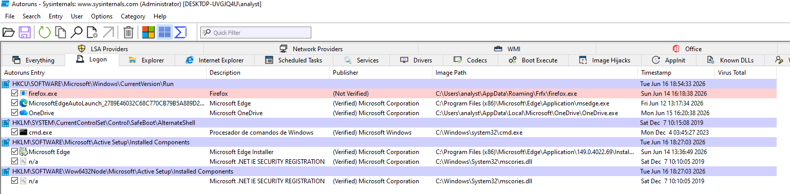
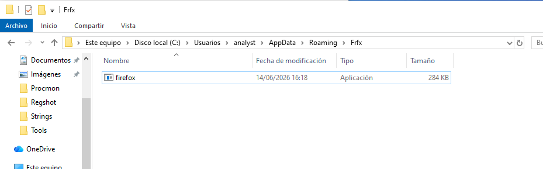
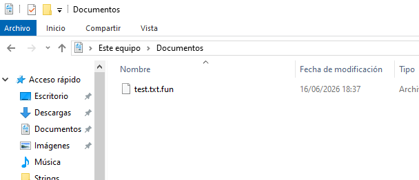
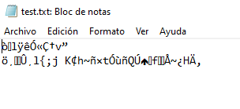

# Findings Summary

## Resumen ejecutivo

La muestra `malware.exe` analizada en la versión **v1.0 — Malware Triage Base** presenta comportamiento malicioso compatible con ransomware o blackmailer.

El análisis estático identificó el nombre interno `BitcoinBlackmailer.exe`, cadenas relacionadas con cifrado, descifrado, Bitcoin y mensajes de extorsión. También se observaron indicios compatibles con ofuscación mediante ConfuserEx y una sección anómala denominada `!!mUPp`.

El análisis dinámico confirmó comportamientos relevantes como creación de copias en rutas del perfil del usuario, persistencia mediante clave Run en HKCU, suplantación de Firefox, ejecución de un proceso secundario `drpbx.exe` y modificación de un archivo de prueba con la extensión `.fun`.

No se observó comunicación externa efectiva durante la captura de red. Sin embargo, durante el análisis estático se identificó la URL `http://btc.blockr.io/api/v1/`, que se mantiene como IOC estático.

---

## Hallazgos principales

| Hallazgo             | Descripción                                         |
| -------------------- | --------------------------------------------------- |
| Nombre de la muestra | `malware.exe`                                       |
| Nombre interno       | `BitcoinBlackmailer.exe`                            |
| Tipo de amenaza      | Compatible con ransomware / blackmailer             |
| Tecnología probable  | .NET                                                |
| Posible ofuscación   | Indicios compatibles con ConfuserEx                 |
| Sección anómala      | `!!mUPp` con entropía elevada                       |
| Persistencia         | Clave Run en HKCU                                   |
| Suplantación         | Firefox / `firefox.exe`                             |
| Archivo persistente  | `C:\Users\analyst\AppData\Roaming\Frfx\firefox.exe` |
| Artefacto secundario | `C:\Users\analyst\AppData\Local\Drpbx\drpbx.exe`    |
| Proceso observado    | `drpbx.exe`                                         |
| Directorio creado    | `C:\Users\analyst\AppData\Roaming\System32Work`     |
| Archivo afectado     | `C:\Users\analyst\Documents\test.txt.fun`           |
| Extensión añadida    | `.fun`                                              |
| URL estática         | `http://btc.blockr.io/api/v1/`                      |
| Comunicación externa | No observada durante la captura                     |
| Mutex                | No identificado                                     |

---

## Resumen del análisis estático

Durante el análisis estático se identificaron indicadores suficientes para considerar la muestra sospechosa antes de ejecutarla.

Los elementos más relevantes fueron:

* Ejecutable PE32 de 32 bits.
* Subsistema GUI.
* Uso probable de .NET.
* Nombre interno `BitcoinBlackmailer.exe`.
* Firma digital no detectada.
* Metadatos asociados a Firefox.
* Cadenas relacionadas con cifrado y descifrado.
* Mensajes de extorsión.
* Referencia a Bitcoin.
* Posibles indicios de ofuscación compatibles con ConfuserEx.

Las cadenas más relevantes fueron:

```text
BitcoinBlackmailer.exe
EncryptFile
DecryptFile
CreateEncryptor
MemoryStream
WinExec
VirtualProtect
Run
http://btc.blockr.io/api/v1/
Your computer files have been encrypted
You have 24 hours to pay 150 USD in Bitcoins to get the decryption key
After 72 hours all that are left will be deleted
```

Estos indicadores permiten formular una hipótesis inicial de ransomware o blackmailer.

*Figura 1: Cadenas relevantes Floss.*

---

## Resumen del análisis dinámico

Durante la ejecución de la muestra en la máquina Windows 10 aislada se observaron comportamientos consistentes con las hipótesis del análisis estático.

La muestra:

* Se ejecutó inicialmente como `malware.exe`.
* Creó una copia persistente como `firefox.exe`.
* Creó una copia secundaria como `drpbx.exe`.
* Generó directorios en rutas del perfil del usuario.
* Estableció persistencia mediante una clave Run en HKCU.
* Suplantó a Firefox mediante nombre, descripción y ruta.
* Modificó un archivo de prueba.
* Renombró el archivo afectado con la extensión `.fun`.
* Mostró una ventana visible titulada “Thank you”.

El comportamiento más relevante fue la combinación de persistencia, suplantación y modificación de archivos.

---

## Persistencia

La persistencia se estableció mediante la clave:

```text
HKCU\SOFTWARE\Microsoft\Windows\CurrentVersion\Run
```

Con el valor:

```text
firefox.exe
```

Apuntando a:

```text
C:\Users\analyst\AppData\Roaming\Frfx\firefox.exe
```

Este mecanismo permite que la muestra se ejecute automáticamente al iniciar sesión el usuario afectado.

*Figura 2: Prueba persistencia Autoruns*

---

## Suplantación

La muestra utiliza elementos asociados a Firefox para dificultar su identificación:

* Nombre `firefox.exe`.
* Descripción Firefox.
* Proceso visible como Firefox.
* Entrada de persistencia con nombre `firefox.exe`.
* Ubicación en una ruta de usuario no estándar.

La ruta observada:

```text
C:\Users\analyst\AppData\Roaming\Frfx\firefox.exe
```

No corresponde a una instalación legítima estándar de Firefox, por lo que se considera un indicador de suplantación.

*Figura 3: Prueba persistencia malware*

---

## Modificación de archivos

La muestra modificó un archivo de prueba ubicado en la carpeta Documentos del usuario.

El archivo original:

```text
test.txt
```

Fue renombrado como:

```text
test.txt.fun
```

El contenido quedó ilegible, lo que indica un comportamiento compatible con cifrado o alteración maliciosa.

Este hallazgo se correlaciona con las cadenas estáticas relacionadas con cifrado:

```text
EncryptFile
DecryptFile
CreateEncryptor
Your computer files have been encrypted
```
*Figura 4: Test de documento encriptado*

*Figura 5: Test de contenido documento encriptado*

---

## Actividad de red

Durante la captura con Wireshark se observó únicamente tráfico propio del sistema:

* DHCP.
* DHCPv6.
* LLMNR.

No se observaron:

* Consultas DNS externas atribuibles al malware.
* Tráfico HTTP atribuible al malware.
* Tráfico HTTPS atribuible al malware.
* Conexiones TCP externas atribuibles al malware.
* Comunicación efectiva con `http://btc.blockr.io/api/v1/`.

La ausencia de comunicación externa puede deberse al aislamiento de red configurado en la VM.

---

## Indicadores de compromiso destacados

| Tipo                | Valor                                                              |
| ------------------- | ------------------------------------------------------------------ |
| MD5                 | `2773E3DC59472296CB0024BA715A64E`                                  |
| SHA1                | `27D99FBCA067F478B91CDCB92F13A828B00859`                           |
| SHA256              | `3AE96F73D805E1D3995253DB4D910300D8442EA603737A1428B613061E7F61E7` |
| Nombre interno      | `BitcoinBlackmailer.exe`                                           |
| Archivo persistente | `C:\Users\analyst\AppData\Roaming\Frfx\firefox.exe`                |
| Archivo secundario  | `C:\Users\analyst\AppData\Local\Drpbx\drpbx.exe`                   |
| Clave de registro   | `HKCU\SOFTWARE\Microsoft\Windows\CurrentVersion\Run\firefox.exe`   |
| Extensión añadida   | `.fun`                                                             |
| URL estática        | `http://btc.blockr.io/api/v1/`                                     |
| Proceso observado   | `drpbx.exe`                                                        |
| Suplantación        | Firefox                                                            |

---

## Valor defensivo

Los hallazgos obtenidos permiten generar material útil para fases defensivas posteriores:

* Reglas YARA basadas en strings y metadatos.
* Reglas Sigma basadas en persistencia y rutas sospechosas.
* Búsquedas en SIEM.
* Hunting sobre endpoints Windows.
* Correlación con eventos Sysmon.
* Investigación SOC en un laboratorio posterior.
* Mapeo MITRE ATT&CK.

Este laboratorio servirá como base para un segundo proyecto orientado a detección e investigación SOC con Wazuh, Sysmon y/o Splunk.

---

## Limitaciones

La v1.0 no incluye:

* Análisis de memoria.
* Volcado de proceso.
* Extracción de strings en memoria.
* Identificación de mutex.
* Reversing avanzado.
* Debugging.
* Simulación de red con FakeNet-NG o INetSim.
* Confirmación dinámica de comunicación externa.

Estas limitaciones quedan planificadas para versiones posteriores.

---

## Conclusión

La muestra `malware.exe` presenta comportamiento malicioso claro.

Los hallazgos más relevantes son:

* Nombre interno `BitcoinBlackmailer.exe`.
* Referencias a cifrado, Bitcoin y extorsión.
* Indicios compatibles con ofuscación.
* Persistencia mediante clave Run.
* Copia como `firefox.exe`.
* Creación de `drpbx.exe`.
* Suplantación de Firefox.
* Modificación de archivos con extensión `.fun`.
* Ausencia de comunicación externa observable durante la captura.

En conjunto, la muestra es compatible con ransomware o blackmailer y deja indicadores suficientes para su detección, documentación y reutilización en escenarios defensivos posteriores.
