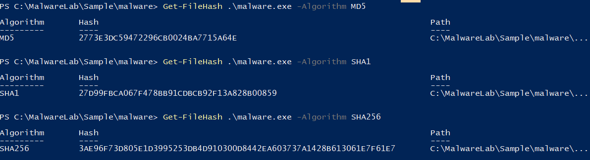

# Indicators of Compromise

## Objetivo

Este documento recoge los indicadores de compromiso extraídos durante la versión **v1.0 — Malware Triage Base** del laboratorio.

Los IOCs proceden del análisis estático, análisis dinámico y análisis de red de la muestra `malware.exe`.

---

## Resumen

La muestra analizada fue identificada internamente como `BitcoinBlackmailer.exe` y presentó comportamiento compatible con ransomware o blackmailer.

Los principales indicadores observados incluyen:

* Hashes de la muestra.
* Nombre interno del binario.
* Copias creadas en rutas del perfil de usuario.
* Persistencia mediante clave Run.
* Suplantación de Firefox.
* Proceso secundario `drpbx.exe`.
* Modificación de archivo con extensión `.fun`.
* URL estática relacionada con Bitcoin.

---

## Hashes

| Tipo   | Valor                                                              |
| ------ | ------------------------------------------------------------------ |
| MD5    | `2773E3DC59472296CB0024BA715A64E`                                  |
| SHA1   | `27D99FBCA067F478B91CDCB92F13A828B00859`                           |
| SHA256 | `3AE96F73D805E1D3995253DB4D910300D8442EA603737A1428B613061E7F61E7` |

*Figura 1: Resultados hashes malware.exe.*

---

## Identificación del binario

| Tipo                        | Valor                    |
| --------------------------- | ------------------------ |
| Nombre de archivo analizado | `malware.exe`            |
| Nombre interno              | `BitcoinBlackmailer.exe` |
| Tipo de archivo             | PE32                     |
| Arquitectura                | x86 / 32 bits            |
| Subsistema                  | GUI                      |
| Tecnología probable         | .NET                     |
| Firma digital               | No detectada             |
| Posible ofuscación          | ConfuserEx               |
| Sección anómala             | `!!mUPp`                 |

---

## Archivos y rutas

| Tipo                | Valor                                               |
| ------------------- | --------------------------------------------------- |
| Archivo original    | `C:\MalwareLab\Sample\malware\malware.exe`          |
| Archivo persistente | `C:\Users\analyst\AppData\Roaming\Frfx\firefox.exe` |
| Archivo secundario  | `C:\Users\analyst\AppData\Local\Drpbx\drpbx.exe`    |
| Directorio creado   | `C:\Users\analyst\AppData\Roaming\System32Work`     |
| Archivo modificado  | `C:\Users\analyst\Documents\test.txt.fun`           |

---

## Procesos observados

| Proceso       | Descripción                                       |
| ------------- | ------------------------------------------------- |
| `malware.exe` | Proceso inicial ejecutado manualmente             |
| `drpbx.exe`   | Proceso posterior observado durante la ejecución  |
| `firefox.exe` | Nombre utilizado para suplantación y persistencia |

---

## Registro

| Tipo             | Valor                                                |
| ---------------- | ---------------------------------------------------- |
| Clave modificada | `HKCU\SOFTWARE\Microsoft\Windows\CurrentVersion\Run` |
| Valor creado     | `firefox.exe`                                        |
| Ruta apuntada    | `C:\Users\analyst\AppData\Roaming\Frfx\firefox.exe`  |
| Finalidad        | Persistencia al inicio de sesión del usuario         |

*Figura 2: Resultados hashes malware.exe.*

---

## Red

| Tipo                          | Valor                           |
| ----------------------------- | ------------------------------- |
| URL estática                  | `http://btc.blockr.io/api/v1/`  |
| Dominio observado en tráfico  | No observado                    |
| IP externa                    | No identificada                 |
| Comunicación HTTP/HTTPS       | No observada                    |
| Comunicación externa efectiva | No observada durante la captura |
| Tráfico observado             | DHCP, DHCPv6, LLMNR             |

---

## Cadenas relevantes

| Cadena                                                                   | Interpretación                                   |
| ------------------------------------------------------------------------ | ------------------------------------------------ |
| `BitcoinBlackmailer.exe`                                                 | Nombre interno relacionado con extorsión         |
| `EncryptFile`                                                            | Posible función de cifrado                       |
| `DecryptFile`                                                            | Posible función de descifrado                    |
| `CreateEncryptor`                                                        | Uso probable de primitivas criptográficas        |
| `MemoryStream`                                                           | Manipulación de datos en memoria                 |
| `WinExec`                                                                | Posible ejecución de procesos                    |
| `VirtualProtect`                                                         | Modificación de permisos de memoria              |
| `Run`                                                                    | Posible relación con persistencia                |
| `Your computer files have been encrypted`                                | Mensaje asociado a cifrado/extorsión             |
| `You have 24 hours to pay 150 USD in Bitcoins to get the decryption key` | Mensaje de extorsión solicitando pago en Bitcoin |
| `After 72 hours all that are left will be deleted`                       | Amenaza de borrado o pérdida de archivos         |

*Figura 3: Cadenas relevantes Floss.*

---

## Otros indicadores

| Tipo               | Valor                 |
| ------------------ | --------------------- |
| Extensión añadida  | `.fun`                |
| Suplantación       | Firefox               |
| Mutex              | No identificado       |
| Strings en memoria | No analizadas en v1.0 |
| Dominio en tráfico | No observado          |
| IP externa         | No identificada       |

*Figura 4: Test de documento encriptado*

---

## Clasificación de IOCs por fuente

| Fuente            | IOCs obtenidos                                                                    |
| ----------------- | --------------------------------------------------------------------------------- |
| Análisis estático | Hashes, nombre interno, strings, URL estática, posible ofuscación                 |
| Análisis dinámico | Archivos creados, proceso `drpbx.exe`, persistencia, archivo `.fun`, suplantación |
| Análisis de red   | Tráfico DHCP/DHCPv6/LLMNR, sin comunicación externa atribuible                    |
| Autoruns          | Clave Run en HKCU                                                                 |
| Process Monitor   | Creación de rutas en AppData y actividad de registro                              |
| Process Explorer  | Proceso `drpbx.exe` con descripción Firefox                                       |
| Regshot           | Cambios de registro contrastados con Autoruns/ProcMon                             |
| Wireshark         | Ausencia de tráfico externo atribuible                                            |

---

## Uso defensivo

Estos IOCs pueden utilizarse para:

* Reglas YARA.
* Reglas Sigma.
* Búsquedas en SIEM.
* Hunting sobre endpoints Windows.
* Correlación con eventos Sysmon.
* Investigación SOC.
* Bloqueo por hash en herramientas defensivas.
* Búsqueda de persistencia en claves Run.
* Detección de ejecución desde rutas AppData.
* Detección de suplantación de software legítimo.

---

## Limitaciones

Los IOCs deben interpretarse dentro del contexto del laboratorio.

Limitaciones principales:

* No se identificó mutex.
* No se analizaron strings en memoria.
* No se confirmó comunicación externa.
* No se realizó análisis de memoria.
* No se realizó reversing avanzado.
* La URL estática no fue observada dinámicamente.
* Las rutas contienen el usuario del laboratorio `analyst`.

---

## Conclusión

La muestra deja indicadores suficientes para detección y hunting defensivo.

Los IOCs más relevantes son el hash SHA256, el nombre interno `BitcoinBlackmailer.exe`, la persistencia en HKCU Run, la copia `firefox.exe` en AppData, el proceso `drpbx.exe`, la extensión `.fun` y la URL estática relacionada con Bitcoin.
