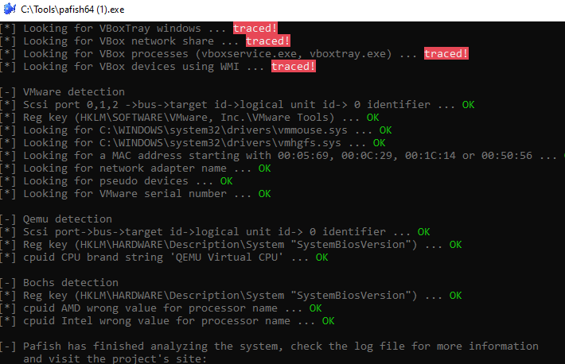

# MITRE ATT&CK Mapping

## Objetivo

Este documento relaciona los comportamientos observados durante el análisis de `malware.exe` con técnicas de **MITRE ATT&CK**.

El mapeo se basa únicamente en comportamientos observados o suficientemente justificados durante el análisis estático y dinámico de la muestra.

---

## Resumen

La muestra presenta comportamientos asociados principalmente a:

* Ejecución de malware por el usuario.
* Persistencia mediante clave Run.
* Suplantación de software legítimo.
* Uso de rutas del perfil de usuario.
* Modificación o cifrado de archivos.
* Posible awareness del entorno virtual.
* Referencias estáticas a comunicación relacionada con Bitcoin.

---

## Mapeo principal

| Comportamiento observado                                | Técnica MITRE ATT&CK                                                  | Táctica             | Justificación                                                                          |
| ------------------------------------------------------- | --------------------------------------------------------------------- | ------------------- | -------------------------------------------------------------------------------------- |
| Ejecución manual de `malware.exe`                       | User Execution                                                        | Execution           | La muestra fue ejecutada manualmente desde la ruta de laboratorio                      |
| Creación de clave Run en HKCU                           | Boot or Logon Autostart Execution: Registry Run Keys / Startup Folder | Persistence         | Se creó un valor `firefox.exe` en `HKCU\SOFTWARE\Microsoft\Windows\CurrentVersion\Run` |
| Copia como `firefox.exe`                                | Masquerading                                                          | Defense Evasion     | La muestra utiliza el nombre de un software legítimo para ocultar su propósito         |
| Descripción asociada a Firefox                          | Masquerading                                                          | Defense Evasion     | Autoruns y Process Explorer muestran artefactos con descripción Firefox                |
| Ejecución desde AppData                                 | Hide Artifacts / Masquerading                                         | Defense Evasion     | La muestra crea copias en rutas del perfil del usuario                                 |
| Creación de `drpbx.exe`                                 | Masquerading                                                          | Defense Evasion     | El proceso secundario utiliza un nombre aparentemente legítimo y descripción Firefox   |
| Modificación de `test.txt` a `test.txt.fun`             | Data Encrypted for Impact                                             | Impact              | El archivo queda ilegible y se añade una extensión nueva                               |
| Strings `EncryptFile`, `DecryptFile`, `CreateEncryptor` | Data Encrypted for Impact                                             | Impact              | Las cadenas sugieren funcionalidad de cifrado o manipulación criptográfica             |
| Detección de artefactos VirtualBox con Pafish           | Virtualization/Sandbox Evasion                                        | Defense Evasion     | El entorno presenta indicadores que podrían ser detectados por malware anti-VM         |
| URL `http://btc.blockr.io/api/v1/`                      | Application Layer Protocol                                            | Command and Control | La URL aparece en strings, aunque no se confirmó comunicación dinámica                 |

---

## Técnicas prioritarias

| Técnica                            | Prioridad  | Motivo                                                                                  |
| ---------------------------------- | ---------- | --------------------------------------------------------------------------------------- |
| Registry Run Keys / Startup Folder | Alta       | Persistencia confirmada mediante Autoruns y ProcMon                                     |
| Masquerading                       | Alta       | Uso claro de `firefox.exe`, descripción Firefox y ruta no estándar                      |
| Data Encrypted for Impact          | Alta       | Archivo `.fun` con contenido ilegible y strings de cifrado                              |
| Virtualization/Sandbox Evasion     | Media      | El entorno es detectable por Pafish, aunque no se confirmó evasión activa de la muestra |
| Application Layer Protocol         | Baja/Media | URL estática identificada, pero sin comunicación observada                              |

---

## Persistencia

### Técnica relacionada

```text
Boot or Logon Autostart Execution: Registry Run Keys / Startup Folder
```

### Evidencia

La muestra crea persistencia mediante:

```text
HKCU\SOFTWARE\Microsoft\Windows\CurrentVersion\Run\firefox.exe
```

*Figura 1: Resultados hashes malware.exe.*

Apuntando a:

```text
C:\Users\analyst\AppData\Roaming\Frfx\firefox.exe
```

*Figura 2: Prueba persistencia malware*

### Interpretación

Este mecanismo permite la ejecución automática del malware al iniciar sesión el usuario. Al utilizar HKCU, la persistencia afecta al usuario actual y no requiere privilegios de administrador.

---

## Defense Evasion / Masquerading

### Técnica relacionada

```text
Masquerading
```

### Evidencia

La muestra utiliza elementos asociados a Firefox:

* Nombre `firefox.exe`.
* Descripción Firefox.
* Copia en `AppData\Roaming\Frfx`.
* Proceso visible como Firefox.
* Entrada de persistencia denominada `firefox.exe`.

### Interpretación

El objetivo probable es dificultar la identificación del binario como malicioso utilizando un nombre familiar para el usuario y para el analista.

---

## Impact

### Técnica relacionada

```text
Data Encrypted for Impact
```

### Evidencia

La muestra modifica un archivo de prueba:

```text
test.txt → test.txt.fun
```

*Figura 3: Test de documento encriptado*

El contenido queda ilegible tras la ejecución.

*Figura 4: Test de documento encriptado*

Además, el análisis estático identificó cadenas relacionadas con cifrado y extorsión:

```text
EncryptFile
DecryptFile
CreateEncryptor
Your computer files have been encrypted
```

### Interpretación

Aunque no se realizó reversing ni análisis criptográfico, la combinación de cadenas estáticas y modificación dinámica del archivo resulta compatible con comportamiento de cifrado o alteración maliciosa.

---

## Command and Control

### Técnica relacionada

```text
Application Layer Protocol
```

### Evidencia

Durante el análisis estático se identificó la URL:

```text
http://btc.blockr.io/api/v1/
```

### Interpretación

La URL parece relacionada con consulta de información sobre Bitcoin.

No se observó comunicación efectiva con esta URL durante la captura de red, por lo que se mantiene como IOC estático, no como comunicación C2 confirmada.

---

## Virtualization / Sandbox Awareness

### Técnica relacionada

```text
Virtualization/Sandbox Evasion
```

### Evidencia

Pafish detectó múltiples indicadores asociados a VirtualBox:

* Vendor `VBoxVBoxVBox`.
* Claves de registro de VirtualBox.
* Drivers de Guest Additions.
* Procesos `vboxservice.exe` y `vboxtray.exe`.
* MAC con prefijo `08:00:27`.
* Ausencia de interacción de usuario.

*Figura 5: Indicadores de entorno virtualizado*

### Interpretación

Esto no demuestra por sí solo que la muestra haya ejecutado técnicas anti-VM, pero sí documenta que el entorno no era completamente verosímil frente a malware con capacidades de detección de sandbox.

Se considera una limitación del análisis y un punto de mejora para versiones posteriores.

---

## Técnicas no confirmadas

No se mapearon como confirmadas las siguientes técnicas:

| Técnica                        | Motivo                                                    |
| ------------------------------ | --------------------------------------------------------- |
| Command and Control confirmado | No se observó comunicación externa durante la captura     |
| Credential Access              | No se observaron intentos de robo de credenciales         |
| Lateral Movement               | No se observó movimiento lateral                          |
| Discovery                      | No se documentó enumeración del sistema o red             |
| Exfiltration                   | No se observó salida de datos                             |
| Mutex / Event Objects          | No se identificó mutex                                    |
| Process Injection              | No se confirmó inyección de procesos                      |
| Defense Evasion avanzada       | No se realizó reversing ni análisis de memoria suficiente |

---

## Relación con detecciones

El mapeo MITRE puede utilizarse para construir detecciones defensivas:

| Técnica                            | Detección posible                                        |
| ---------------------------------- | -------------------------------------------------------- |
| Registry Run Keys / Startup Folder | Sigma/Wazuh: modificación de Run Key apuntando a AppData |
| Masquerading                       | Sigma: `firefox.exe` ejecutado desde ruta no estándar    |
| Data Encrypted for Impact          | Detección de creación de archivos con extensión `.fun`   |
| Application Layer Protocol         | Búsqueda de URL estática o tráfico HTTP relacionado      |
| Virtualization/Sandbox Evasion     | Documentación de limitación del entorno                  |

---

## Conclusión

El análisis de `malware.exe` permite mapear la muestra principalmente a técnicas de persistencia, suplantación y modificación/cifrado de archivos.

Las técnicas más relevantes desde el punto de vista defensivo son:

* Persistencia mediante Run Key.
* Masquerading como Firefox.
* Uso de rutas AppData.
* Modificación de archivos con extensión `.fun`.
* Indicadores estáticos relacionados con Bitcoin.

Este mapeo sirve como base para crear reglas Sigma/YARA y para reutilizar los hallazgos en un laboratorio SOC posterior.
