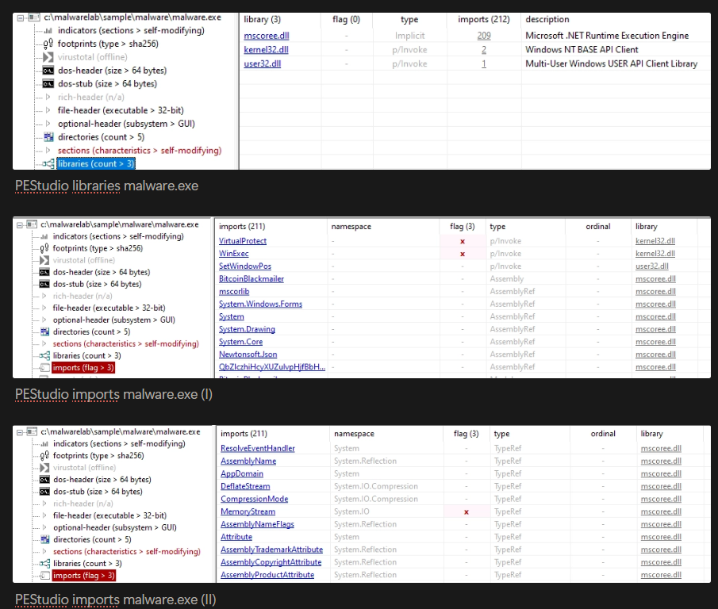
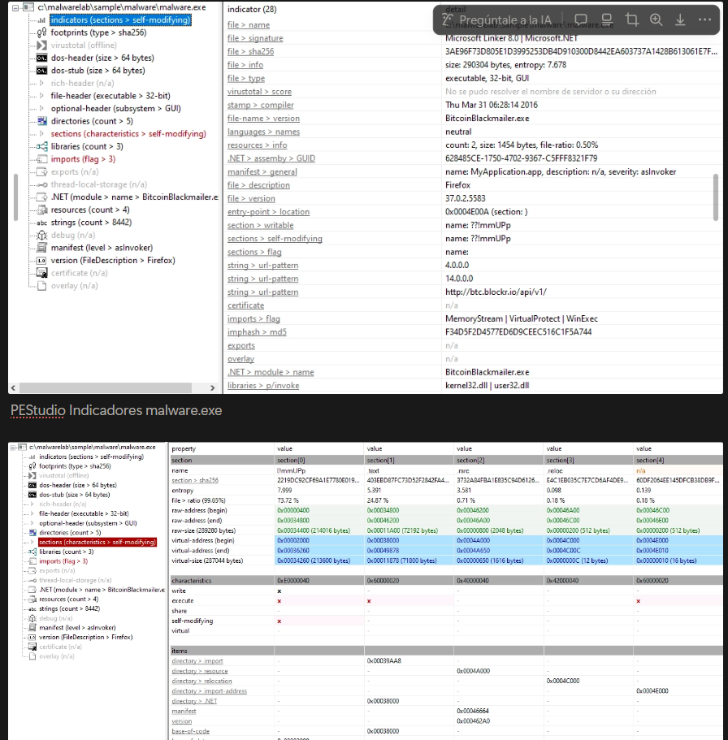

# Static Analysis

## Objetivo

El objetivo del análisis estático es examinar la muestra `malware.exe` sin ejecutarla, identificando propiedades del binario, hashes, strings, imports, posibles indicadores de ofuscación e IOCs preliminares.

---

## Herramientas utilizadas

| Herramienta | Uso                                                      |
| ----------- | -------------------------------------------------------- |
| PE Studio   | Revisión del PE, imports, secciones, strings y metadatos |
| PEiD        | Identificación básica de packer                          |
| ExeInfo PE  | Detección de compilador/protector/ofuscador              |
| Strings     | Extracción de cadenas legibles                           |
| FLOSS       | Extracción adicional de cadenas                          |

---

## Identificación de la muestra

| Campo               | Resultado                              |
| ------------------- | -------------------------------------- |
| Nombre del archivo  | `malware.exe`                          |
| Tamaño              | 290.304 bytes                          |
| Tipo de archivo     | PE32                                   |
| Arquitectura        | x86 / 32 bits                          |
| Subsistema          | GUI                                    |
| Tecnología probable | .NET                                   |
| Timestamp           | Thu Mar 31 06:28:14 2016 UTC           |
| Nombre interno      | `BitcoinBlackmailer.exe`               |
| Suplantación        | Firefox                                |
| Firma digital       | No detectada                           |
| Posible ofuscación  | Indicadores compatibles con ConfuserEx |

---

## Hashes

| Tipo   | Valor                                                              |
| ------ | ------------------------------------------------------------------ |
| MD5    | `2773E3DC59472296CB0024BA715A64E`                                  |
| SHA1   | `27D99FBCA067F478B91CDCB92F13A828B00859`                           |
| SHA256 | `3AE96F73D805E1D3995253DB4D910300D8442EA603737A1428B613061E7F61E7` |

*Figura 1: Resultados hashes malware.exe.*

---

## Cadenas relevantes

| Cadena                                                                   | Interpretación                            |
| ------------------------------------------------------------------------ | ----------------------------------------- |
| `BitcoinBlackmailer.exe`                                                 | Nombre interno relacionado con extorsión  |
| `EncryptFile`                                                            | Posible función de cifrado                |
| `DecryptFile`                                                            | Posible función de descifrado             |
| `CreateEncryptor`                                                        | Uso probable de primitivas criptográficas |
| `MemoryStream`                                                           | Manipulación de datos en memoria          |
| `WinExec`                                                                | Posible ejecución de procesos             |
| `VirtualProtect`                                                         | Modificación de permisos de memoria       |
| `Run`                                                                    | Posible relación con persistencia         |
| `http://btc.blockr.io/api/v1/`                                           | URL relacionada con Bitcoin               |
| `Your computer files have been encrypted`                                | Mensaje de cifrado/extorsión              |
| `You have 24 hours to pay 150 USD in Bitcoins to get the decryption key` | Mensaje de pago en Bitcoin                |
| `After 72 hours all that are left will be deleted`                       | Amenaza de borrado o pérdida de archivos  |

*Figura 2: Cadenas relevantes Floss.*

---

## DLL destacadas

| DLL            | Interpretación                                            |
| -------------- | --------------------------------------------------------- |
| `mscoree.dll`  | Uso del entorno Microsoft .NET                            |
| `kernel32.dll` | Funciones base de procesos, memoria y sistema de archivos |
| `user32.dll`   | Interfaz gráfica y ventanas                               |

*Figura 3: PEStudio report.*

---

## Ofuscación

PEiD no detectó un packer concreto. Sin embargo, ExeInfo PE mostró indicios compatibles con ConfuserEx.

*Figura 4: Exeinfo PE packer.*

Además, PE Studio identificó una sección anómala denominada `!!mUPp`, con entropía elevada, lo que refuerza la hipótesis de ofuscación o protección propia de binarios .NET.

*Figura 5: Secciones e indicadores PE Studio.*

---

## Evidencias asociadas

| Evidencia     | Descripción                                              |
| ------------- | -------------------------------------------------------- |
| PE Studio     | Identificación PE32, x86, .NET, GUI, timestamp e imports |
| ExeInfo PE    | Indicios compatibles con ConfuserEx                      |
| PEiD          | No detección de packer concreto                          |
| Strings/FLOSS | Cadenas de cifrado, Bitcoin y extorsión                  |

---

## Conclusión

El análisis estático permite clasificar la muestra como sospechosa antes de ejecutarla.

Los principales indicadores son el nombre interno `BitcoinBlackmailer.exe`, las cadenas relacionadas con cifrado y extorsión, la URL asociada a Bitcoin, la suplantación de Firefox y los indicios de ofuscación compatibles con ConfuserEx.
